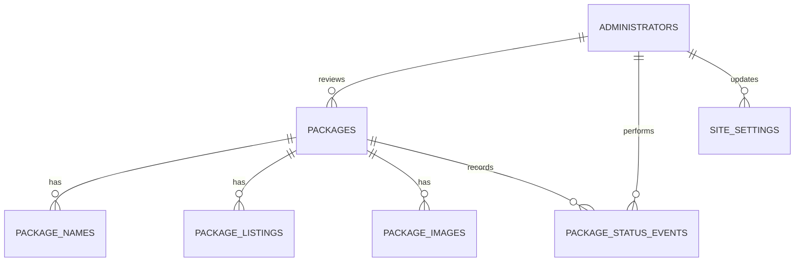

# AppBuilder Container app

This repository contains the AppBuilder Container application: a SvelteKit
app deployed as a Cloudflare Worker, backed by Cloudflare D1 (so the Prisma
datasource is SQLite-compatible). It serves the public package catalog, the
public JSON API consumed by the iOS container app, the Scriptoria intake
endpoint, and the admin console for reviewing packages, alongside the Prisma
schema, migrations, and representative seed data.

## Documentation

All project documentation lives in [`docs/`](./docs).

### Guides

- [`docs/local_dev.md`](./docs/local_dev.md) — local development: prerequisites, secrets, database setup, and the route list.
- [`docs/deploying/README.md`](/docs/deploying/README.md) — deploying the Worker to Cloudflare staging and production.
- [`docs/code-breakdown.md`](./docs/code-breakdown.md) — beginner-friendly map of the codebase for readers new to SvelteKit.

## Project structure overview

- Cloudflare D1 is the database.
- The Worker binding is named `DB`.
- The staging database is named `appbuilder-container-staging`.
- Public package consumers do not sign in. Only administrators have application
  accounts, using app-managed credentials.
- Every administrator requires a password hash. The development seed contains
  an intentionally unusable placeholder until the bootstrap flow is built.
- The Scriptoria product UUID is the external idempotency key.
- Every newly received package begins in `PENDING` status. The notification
  payload is never allowed to choose its own moderation status.
- Once the package is marked as `ACTIVE` then updates are only excepted and not changed to `PENDING`.
- The public catalog returns only `ACTIVE` packages.
- API credentials remain Worker secrets for the MVP and are not stored in this
  schema.
  - .dev.vars as SCRIPTORIA_KEY
  - enpdoint.json (the set-scriptoria-key command uses the `--url` parameter)

## Data model

The minimum models are:

- `Package`: one logical Scriptoria product and its current moderation status.
- `PackageName`: searchable primary and alternative language names.
- `PackageListing`: localized public title and descriptions.
- `PackageImage`: resolved image URLs.
- `Administrator`: app-native account for package review and management.
- `PackageStatusEvent`: append-only moderation history.
- `SiteSetting`: singleton row holding admin-configurable site config (title, GlobeHero background image, theme).

A more detailed rendering can be found at [docs/database.md](docs/database.md).

## Current endpoints and files

| Endpoint Name                       | Web Path                                  | Handler File                                            |
| :---------------------------------- | :---------------------------------------- | :------------------------------------------------------ |
| Root Page Load                      | `/` (GET)                                 | `src/routes/+page.server.ts`                            |
| Package Detail Page Load            | `/packages/:id` (GET)                     | `src/routes/packages/[id]/+page.server.ts`               |
| Login Form                          | `/login` (GET)                            | `src/routes/login/+page.server.ts`                      |
| Login Action                        | `/login` (POST)                           | `src/routes/login/+page.server.ts`                      |
| Health Check                        | `/health` (GET)                           | `src/routes/health/+server.ts`                          |
| Search Packages API                 | `/api/v1/packages` (GET)                  | `src/routes/api/v1/packages/+server.ts`                 |
| Get Package Details API             | `/api/v1/packages/:id` (GET)              | `src/routes/api/v1/packages/[id]/+server.ts`            |
| Scriptoria Notification Ingest      | `/api/v1/notifications/scriptoria` (POST) | `src/routes/api/v1/notifications/scriptoria/+server.ts` |
| Logout Handler                      | `/logout` (POST)                          | `src/routes/logout/+server.ts`                          |
| Admin Session Guard                 | `/admin/*` (layout load)                  | `src/routes/admin/+layout.server.ts`                     |
| Admin Page Load / Moderation Action | `/admin` (GET/POST)                       | `src/routes/admin/+page.server.ts`                      |
| Admin Settings Load / Update Action | `/admin/settings` (GET/POST)              | `src/routes/admin/settings/+page.server.ts`              |

## Install and validate

- For running [local dev environment](/docs/local_dev.md)
- For [determining](/docs/deploying/README.md) staging or production for your container app

## REST notification mapping

| Notification field                     | Database destination          |
| -------------------------------------- | ----------------------------- |
| Product UUID from `permalink_url`      | `Package.scriptoriaProductId` |
| Project, publish, and permalink fields | `Package`                     |
| Cleaned `size`                         | `Package.sizeBytes`           |
| `app_lang`                             | `Package` and `PackageName`   |
| `listing[]`                            | `PackageListing`              |
| `image.files[]`                        | `PackageImage`                |
| Request receipt                        | `Package.lastNotificationAt`  |

The ingestion handler must validate and normalize the notification before
writing it. In particular, the supplied example's `"11351769}"` size becomes the
integer `11351769`.
