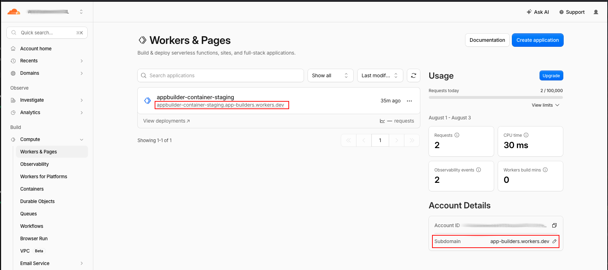

## Production

Production is where you should run your production container app server. This is where Scriptoria will send events to, this is where you will add the packages for your Scripture, and this is where your users will come to download Scripture on their iOS device for your container app.

```bash
npx wrangler d1 create appbuilder-container-production --env production --binding DB --update-config 
```

```bash
npm run set-session-secret -- --env production
```

For production you will need your subdomain from Cloudflare. If it this In the next command you will need to replace <your-subdomain> with that information. To find it look at the screenshot and instructions below the command.

```bash
npm run set-scriptoria-key -- --env production --url https://appbuilder-container-production.<your-subdomain>.workers.dev  
```

There are several places you can get your site. The best is from Cloudflare.
Login | Goto Compute | Workers & Pages
You should see something like this. If the first one is not there the subdomain on the right will be. the full link will be <https://appbuilder-container-staging>.<your-subdomain>.workers.dev.

NOTE: If you need to change your subdomain do it before you run set-scriptoria-key.



```bash
npm run db:migrate:production
npm run deploy:production
npm run create-admin -- --env production --email you@example.org --password "your-admin-password" --name "Display Name"
```

Send the endpoint.json file to the Scriptoria team (next section).

On future minor changes you can use `npm run deploy:production:full`.

## Setup the Scriptoria notification

You will need an endpoint.json file. To verify that one has been generated for you and
contains the correct information use `npm run verify:endpoint -- --url <your production url>`

It will then examine your various config and generate the endpoint.json file at the root of the project. This should be ignored by git and should not be committed to your fork of the project.

Once you have this file send it to the Scriptoria team to setup.

NOTE: If you use `npm run set-scriptoria-key` command after this then you would need to run the verify:endpoint command again and send the file to the Scriptoria team.

## Rollback

`wrangler deploy` keeps prior versions. Roll back from the Cloudflare dashboard
(Workers → the Worker → Deployments → roll back), or redeploy a known-good commit.
Migrations are forward-only — never edit an applied migration; add a new numbered
one instead.
